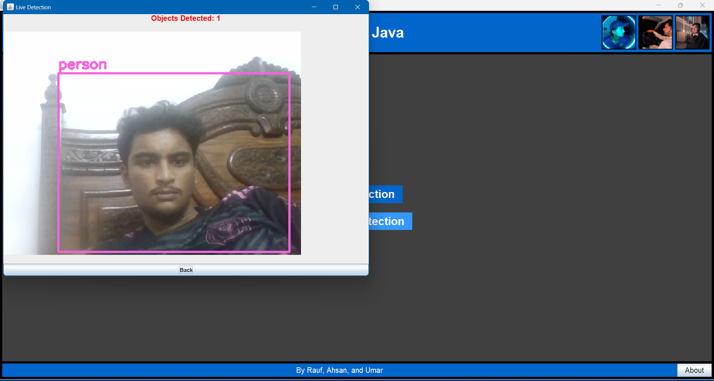
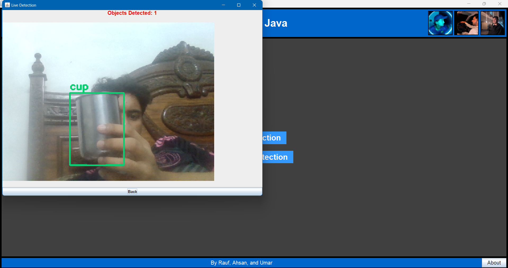
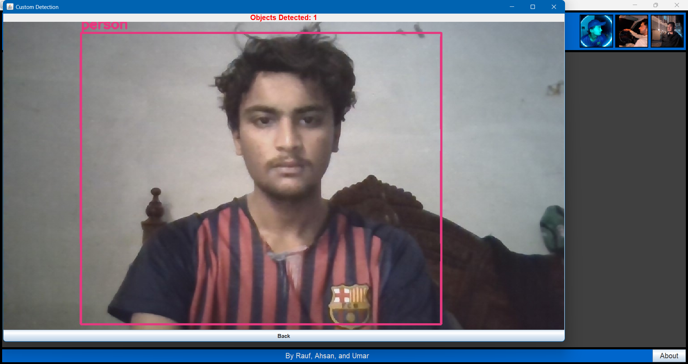

# Object Detection App in Java

This is a Java application for real-time and custom object detection using OpenCV and YOLOv3. It provides a user-friendly interface for live detection from a webcam or custom detection from uploaded images.

## Features

- **Live Detection:** Real-time object detection using your computer's webcam.
- **Custom Detection:** Detect objects in any selected image file.
- **GUI Interface:** Intuitive GUI with options for live detection, custom detection, and saving results.
- **About Section:** Information about the developers and usage instructions.

## Examples pics 
### Live Detection
 


### Custom Detection


## Example Video Demo
<video width="600" controls>
  <source src="images/demo.mp4" type="video/mp4">
  Your browser does not support the video tag.
</video>

## Installation
**Clone Repository:**
```
  git clone https://github.com/Raufjatoi/Object-Detection-App-in-Java
  cd Object-Detection-App-in-Java
```

## Usage
- Run the `app.java` file to launch the Object Detection App.
- Click on "Live Detection" to start real-time detection using your webcam.
- Click on "Custom Detection" to select an image and detect objects within it.
- Follow on-screen instructions for saving detected results.

## Requirements
- Java 8 or higher
- OpenCV 4.9.0 or compatible version
- `coco.names`, `yolov3.cfg`, and `yolov3.weights` files for YOLOv3 model (it be good if ya wanna use Yolov4)

## Authors / Contributes     
L = leader , M = member 
- **Rauf**: Model development (L)     
- **Ahsan**: GUI development  (M)   
- **Umar**: UI design         (M)     

## License

This project is licensed under the MIT License - see the [LICENSE](LICENSE) file for details.

## Support

For any issues or questions, please [open an issue](https://github.com/Raufjatoi/Object-Detection-App-in-Java/issues) here on GitHub. 


## You can check out the version0.java too its pretty much functional too it uses yolov3  (version 0)
## app.java uses yolov4 version 1.0 i call it 